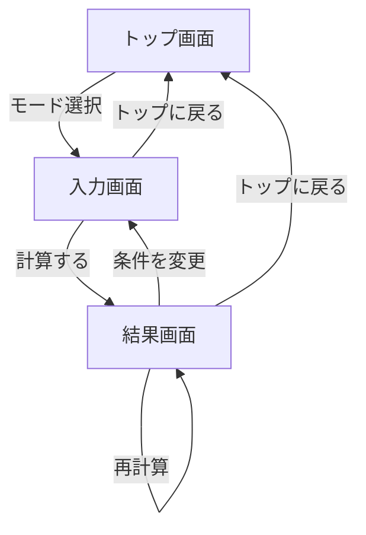

# 画面遷移設計

## 画面一覧

| 画面 | 役割 |
| --- | --- |
| トップ画面 | アプリ名、キャッチコピー、モード選択を表示する |
| 入力画面 | 金額、人数、メンバー名、端数単位、モード別設定を入力する |
| 結果画面 | 計算結果、コメント、再計算、コピー、共有導線を表示する |

## 基本遷移

## トップ画面

### 表示要素

- アプリ名: 飲み代ガチャ
- キャッチコピー例: 今日の会計、ちょっと楽しく決めよう
- モード選択ボタン
  - 通常割り勘
  - 上司多め割り勘
  - 完全ランダム割り勘
  - 端数ルーレット

### 操作

- モードボタン押下で選択モードをstateに保持し、入力画面へ進む。

## 入力画面

### 共通入力

- 合計金額
  - 数値入力
  - 円単位
- 人数
  - 2人以上
  - 人数変更時にメンバー入力欄を増減する
- メンバー名
  - 人数分表示
  - 空欄の場合は表示用に「メンバー1」などの補完名を利用可能
- 端数処理単位
  - 1円
  - 10円
  - 100円

### モード別追加設定

| モード | 追加設定 |
| --- | --- |
| 通常割り勘 | なし |
| 上司多め割り勘 | 各メンバーの立場 |
| 完全ランダム割り勘 | ランダム強度 |
| 端数ルーレット | ルーレット演出の有無は固定でよい |

### 操作

- 計算する
  - バリデーション成功時のみ結果画面へ進む。
  - 失敗時は入力画面内にエラーを表示する。
- 戻る
  - トップ画面へ戻る。

## 結果画面

### 表示要素

- 合計金額
- 選択モード
- 各メンバーの支払いカード
- コメント
- 計算結果の合計
- コピー成功/失敗のフィードバック

### モード別表示

| モード | 表示内容 |
| --- | --- |
| 通常割り勘 | 名前、支払い金額、端数負担者ラベル |
| 上司多め割り勘 | 名前、立場、倍率、支払い金額 |
| 完全ランダム割り勘 | 名前、支払い金額、ランダムコメント |
| 端数ルーレット | 名前、支払い金額、端数負担者を強調表示 |

### 操作

- 再計算
  - 同じ入力条件でランダム要素を再抽選する。
- 条件を変更
  - 入力画面に戻る。
- トップに戻る
  - stateを初期化してトップ画面へ戻る。
- 結果コピー
  - 共有しやすいテキストをクリップボードへコピーする。
- Xで共有
  - 結果テキストを含むX投稿URLを新規タブで開く。
